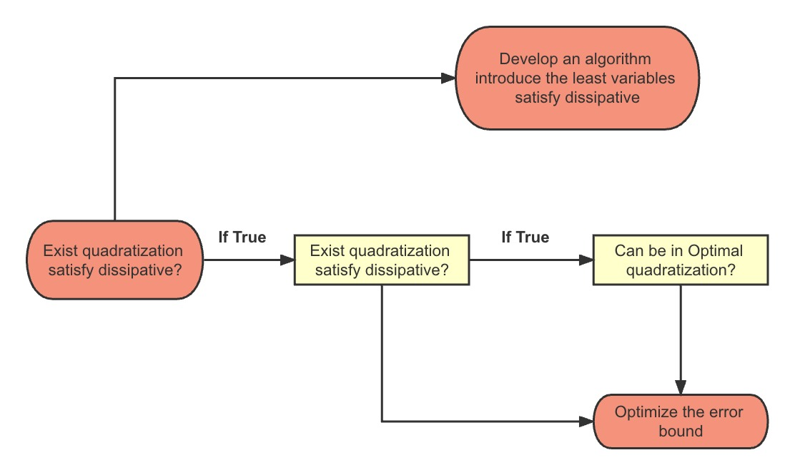

# Personal Research Internship

## Quadratization in the reachability problem for ODEs

### 1. Overview

--- 
I would like to thank the kind professor [Gleb Pogudin](http://www.lix.polytechnique.fr/Labo/Gleb.POGUDIN/) for hosting me during this project in the [MAX](http://www.lix.polytechnique.fr/max/max-web/max/max-home.en.html) team at the [Laboratoire d’informatique de l’École Polytechnique (LIX)](https://www.lix.polytechnique.fr/) and [Centre national de la recherche scientifique (CNRS)](https://www.cnrs.fr/) the Spring of 2023. I am grateful for the guidance from my supervisor Prof. Gleb Pogudin on my research direction and the ideas I received when I encountered a bottleneck in my research.

One of the fundamental problems for dynamical systems is the reachability problem. The problem is: given
a dynamical system (defined by a system of differential equations) and some range of the initial conditions, find
a (rigorous and guaranteed) bound for the state of the system at some other time. This is an important ingredient,
for example, of many approaches to the verification of dynamical systems. The problem is very well studied for
linear systems but is much less understood for the nonlinear case. Forets and Schilling [4] proposes to reduce
the nonlinear case to the linear one by using Carleman linearization. The approach presented in the paper re-
quires the system to have at most quadratic nonlinearities. On the other hand, Gleb Pogudin, the supervisor of
the project, and his colleagues have recently designed an algorithm for transforming any system into such an at
most quadratic form [1].

This project considers specific systems with high-degree nonlinearities and applies the composition of the algo-
rithms described above to solve the reachability problem. The main challenge is to adjust the transformation at
most quadratic systems in a way that would make the subsequent Carleman linearization as numerically stable as
possible. In the project, we try to first explore 3 typical ODE systems with different characteristics, and then we
prove that for any dissipative polynomial ODEs system, there exists a quadratization such that the quadratized
system is dissipative as well. Based on this theorem, we later derive that if all the new variables introduced in
quadratization can be quadratized by other variables, then we can get all negative eigenvalues of the linear part
in the ODEs system.

**Note: In this project, we mainly use Python and Julia to perform numerical operations.**

### 2. Useful Links

--- 
Papers:
- [Reachability of weakly nonlinear systems using Carleman linearization](https://arxiv.org/pdf/2108.10390.pdf)
- [Optimal monomial quadratization for ODE systems](https://arxiv.org/abs/2103.08013)

Code and Library:
- [Repeatibility evaluation for "Reachability of weakly nonlinear systems using Carleman linearization" (RP'21) by Marcelo Forets and Christian Schilling.](https://github.com/JuliaReach/RP21_RE)
- [Qbee](https://github.com/AndreyBychkov/QBee/)

### 3. Introduction to the Problem
---

<kbd>Definition 3.1 (Quadratization of ODE)</kbd> Consider a system of ODEs

$$
\begin{cases} 
x_1^{\prime}=f_1(\bar{x})\\
\ldots \\
x_n^{\prime}=f_n(\bar{x})
\end{cases}
\tag{1}
$$

where $\bar{x}=\left(x_1, \ldots, x_n\right)$ and $f_1, \ldots, f_n \in \mathbb{C}[\mathbf{x}]$. Then a list of new variables

$$
y_1=g_1(\bar{x}), \ldots, y_m=g_m(\bar{x})
$$

is said to be a quadratization of (1) if there exist polynomials $h_1, \ldots, h_{m+n} \in$ $\mathbb{C}[\bar{x}, \bar{y}]$ of degree at most two such that
- $x_i^{\prime}=h_i(\bar{x}, \bar{y})$ for every $1 \leqslant i \leqslant n$
- $y_j^{\prime}=h_{j+n}(\bar{x}, \bar{y})$ for every $1 \leqslant j \leqslant m$

Here we call the number $m$ as the **order of quadratization**. The **optimal quadratization** is the approach that produce the smallest possible order.

<kbd>Example 3.1</kbd> We illustrate the problem with a simple example of a scalar ODE:

$$
x' = x^3 
$$

Since on the right-hand side, the highest degree is $3$, we can introduce a new variable of $y=x^n$ where $n=2,3$. Obviously, introducing $y=x^3$ satisfy the definition of quadrazation, but is not the optimal choice. We introduce a new variable $y:=x^{2}$, then we can write

$$
x'=xy \quad \text{and} \quad y' = 2xx'=2x^{4}=2y^{2}
$$

Now, we can build a new ODEs system as:

$$
    \begin{cases}
        x'=xy\\
        y'=2y^{2}
    \end{cases}
$$

<kbd>Definition 3.2 (Monomial quadratization)</kbd> If all the polynomials $g_1, \ldots, g_m$ are **monomials**, the quadratization is called a monomial quadratization. If a monomial quadratization of a system has the smallest possible order among all the monomial quadratizations of the system, it is called optimal monomial quadratization.

<kbd>Example 3.2</kbd> $y=x^2$ is a monomial quadratization of $x'=x^3$. $y=x^2+x$ is also a quadratization, but not a monomial quadratization.

<kbd>Definition 3.3 (Represenation of quadratic polynomial DE with Kronecker product)</kbd> For a **quadratic polynomial differential equation** $x'(t)=f(x(t))$, we can represent such a ODE as the following format

$$
\frac{\mathrm{d} x(t)}{\mathrm{d} t}=F_1 x+F_2 x^{\otimes 2}
$$

with initial condition $x(0) \in \mathbb{R}^{n}$ and $F_1 \in \mathbb{R}^{n \times n}$ and $F_2 \in \mathbb{R}^{n \times n^{2}}$. $F_1$ and $F_2$ are independent of $t$ and $F_1$ is associated with **linear** behavior of the dynamical system and $F_2$ is the **nonlinear** part.

<mark>Remark</mark> Here we focus on the weakly nonlinear system, therefore $\frac{\|F_2\|_{2}}{\|F_1\|_2}$ should be small since we want the linear part dominate the system of ODEs.

<kbd>Example 3.3</kbd> Assume we have a nonlinear system of ODEs:

$$
\begin{cases}
            x' = ax + by + cxy + dx^{2} \\
            y' = mx + ny + ky^{2}
\end{cases}
$$

We have the linear part matrix $F_1$ and nonlinear part matrix $F_2$

$$
F_{1} = \begin{bmatrix}
    a & b \\
    m & n 
\end{bmatrix} \quad \text{and} \quad F_{2} = \begin{bmatrix}
    d & c & 0 & 0 \\
    0 & 0 & 0 & k
\end{bmatrix}
$$

### 3. Bibliography

---

[1] Andrey Bychkov and Gleb Pogudin. Optimal monomial quadratization for ODE systems. 2021. arXiv: 2103.08013 [cs.SC].

[2] D. C. Carothers et al. “SOME PROPERTIES OF SOLUTIONS TO POLYNOMIAL SYSTEMS OF DIFFERENTIAL EQUATIONS”. In: 2005.

[3] John E Dennis Jr and Robert B Schnabel. Numerical methods for unconstrained optimization and nonlinear equations. SIAM, 1996.

[4] Marcelo Forets and Christian Schilling. “Reachability of Weakly Nonlinear Systems Using Carleman Linearization”. In: Lecture Notes in Computer Science. Springer International Publishing, 2021, pp. 85–99. DOI: 10.1007/978-3-030-89716-1_6. URL: https://doi.org/10.1007%2F978-3-030-89716-1_6.

[5] Roger A Horn and Charles R Johnson. Matrix analysis. Cambridge university press, 2012.

[6] Adolf Hurwitz et al. “On the conditions under which an equation has only roots with negative real parts”. In: Selected papers on mathematical trends in control theory 65 (1964), pp. 273–284.

[7] Ivana Kovacic and Michael J Brennan. The Duffing equation: nonlinear oscillators and their behaviour. John Wiley & Sons, 2011.
