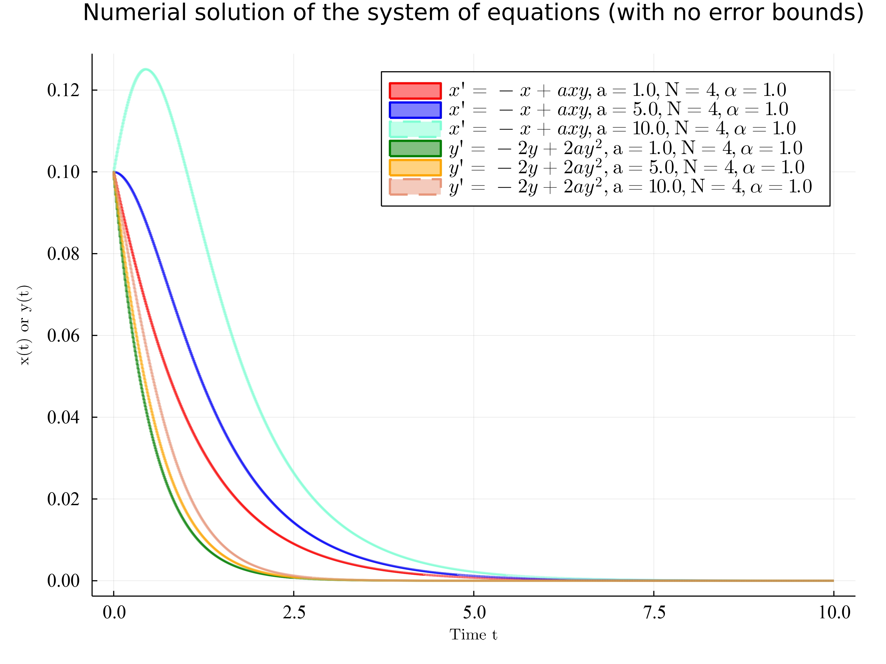
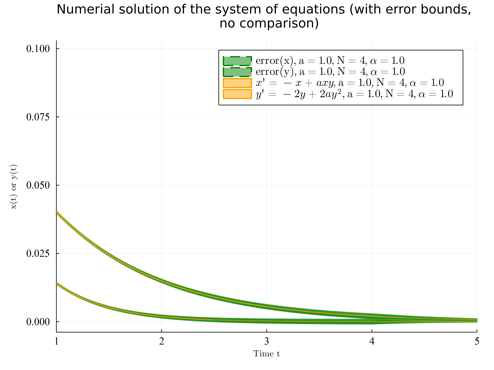
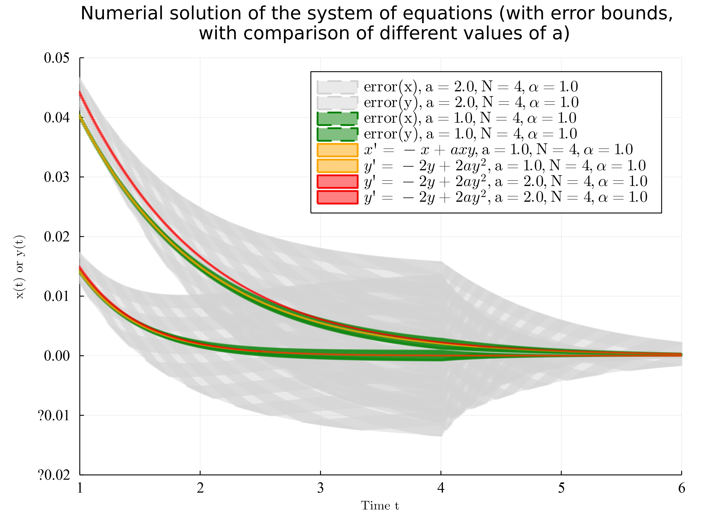

## Week 1 Report - Apply Reachability Analysis to our first Example System

### 1. Useful informations

- **Reachability package**: [[link]](https://github.com/JuliaReach)
- **Carleman linearization**: [[link]](https://github.com/JuliaReach/RP21_RE)
- **Reachability of weakly nonlinear systems using Carleman linearization**: [[link]](https://arxiv.org/abs/2108.10390)

---

### 2. Introduction to Reachability Analysis of Carleman Linearization for quadratized system
Here we use the [[Reachability package]](https://github.com/JuliaReach) which is in julia and the system code [here](https://github.com/JuliaReach/RP21_RE). Here we bring our first example system to the reachability analysis. The system is:

$$
x'=-x+ax^{3}
$$

From quadratization, we know that we can introduce a new variable $w_{0}=y=x^2$ to quadratize the system. Then for the original equation, we have:

$$
\begin{cases}
x' = -x + axy\\
y' = -2y+2ay^{2}
\end{cases}
$$

Then we use the Carleman linearization to linearize the system. Follow the algorithm in the paper [[Reachability of weakly nonlinear systems using Carleman linearization]](https://arxiv.org/abs/2108.10390), we have the $F_1 \in \mathbb{R}^{n \times n}$ matrix for linear part:

$$
F_1=
\begin{matrix}
x \\ y
\end{matrix}
\begin{bmatrix}
-1 & 0 \\
0 & -2  
\end{bmatrix}.
$$

And for the nonlinear part we have $F_2 \in \mathbb{R}^{n \times n^{2}}$ matrix:

$$
F_2=
\begin{matrix}
x \\ y
\end{matrix}
\begin{bmatrix}
0 & 2a & 0 & 0\\
0 & 0 & 0 & a
\end{bmatrix}.
$$

where we have the basis for the nonlinear part is $[x^{2}, xy, yx, y^{2}]$. Since we use quadratization algorithsm to quadratize the system, we should at most have this 4 basis.

Therefore, we can use the algorithsm from the paper **Epidemic model(SEIR)** to analyse this emaple system. The code is [here](https://github.com/JuliaReach/RP21_RE/blob/main/evaluation/SEIR/SEIR.jl).

---

### 3. Results of the plot without Error Bound

We set the Carlimen Linearization matrix as following
```julia
function system_carlin(a, alpha)
  F1 = zeros(2, 2)
  F1[1, 1] = -1
  F1[2, 2] = -2 / alpha

  F2 = zeros(2, 4) # [x, x⊗x]
  F2[1, 2] = 2 * a / alpha
  F2[2, 4] = a

  return F1, F2
end
```
We apply the method `_solve_system_carlin(; N=4, T=30.0, δ=0.1, radius0=0, bloat=false, resets=nothing, alpha, a)` and plot the graph. Here in order to have better numerical plot, we set $\delta=0.01$, Tmax = 10 and N=4. Here we only change the parameter $a$ and keep the parameter $\alpha$ as 1. The have the plot as following:

 

Here we can find the algorithms works pretty well on the system.

---

### 4. Results of the plot with Error Bound

Here we apply the error bound method to the system. We have the following result of the plot:

 

The green part is the error bound. We can see that the error bound is relatively small. The reachability analysis works pretty well on the system with $a=1$ and $\alpha=1$. However, when we change the parameter $a$ to 2, we have the following plot:

 

We can see that the error bound is relatively large. The reason is that the system is not stable when $a=2$. And if we change $a=5$, the algorithms will complain that our $R$ of the reachabilit analysis is $1.4>1$ which not meet the requirement of reachability analysis. Then we gonna study the optimal situation for quadratization which meet the requirement of reachability analysis.