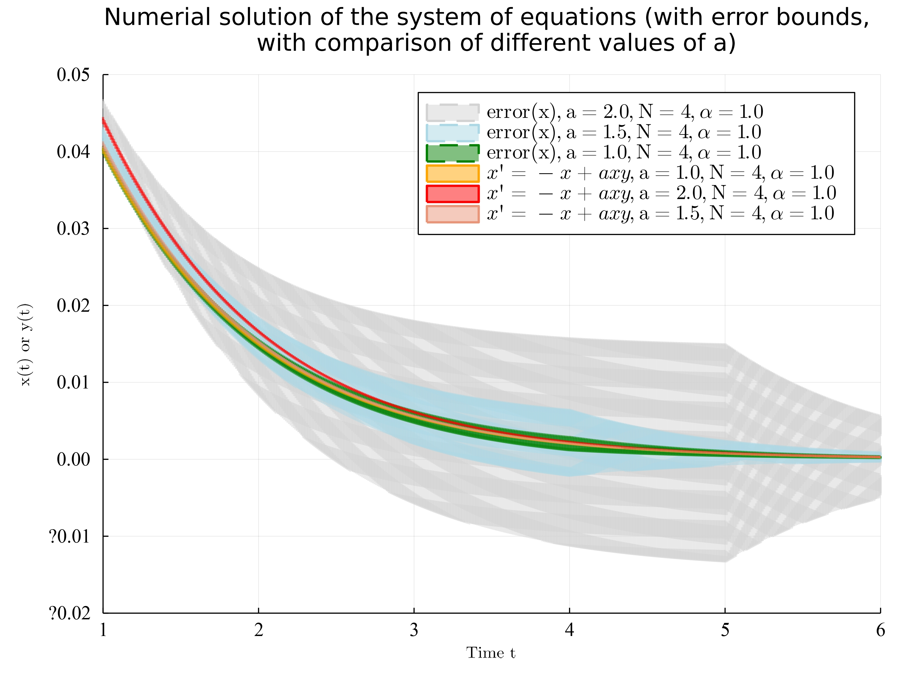

## Week 2 Report - Optimal Quadratization ($\alpha$ value) for Reachability Analysis of the first Example System

### 1. Introduction to the Problem

From previous week, we study the ODE $x'=-x+ax^{3}$ with the following quadratization:

$$
\begin{cases}
x' = -x + axy\\
y' = -2y+2ay^{2}
\end{cases}
$$

where we introduced a new variable $w_{0}=y=x^{2}$ to quadratize the system. Then, we studied the reachability analysis of the system using the Carleman linearization.

Now we want to take a step further and study the optimal quadratization for the system which also produce the least error bound in the reachability analysis. For optimal quadratization, we have several options: $w_{0}=y=x^{2}$ or $w_{0}=y=\alpha x^{2}$ which are equivalent. If we take $w_{0}=y=\alpha x^{2}$, then we have the following computation:

$$
\begin{aligned}
y' &= 2\alpha x x' \\
&= 2\alpha x (-x + ax^3) \\
&= -2\alpha x^{2} + 2\alpha ax^4 \\
\end{aligned}
$$

Since we have $y=\alpha x^2 \Rightarrow x^2 = \frac{1}{\alpha}y$, therefore we have:

$$
-2\alpha x^{2} + 2\alpha ax^4 = -2y + \frac{2a}{\alpha} y^2
$$

Then we have the following system:

$$
\begin{cases}
x' = -x + \frac{a}{\alpha}xy\\
y' = -2y + \frac{2a}{\alpha} y^2
\end{cases}
$$

If we denote the new parameter $k = \frac{a}{\alpha}$, then the system goes back to the original format. Therefore, we can only study the reachability analysis with $b$.

$$
\begin{cases}
x' = -x + =kxy\\
y' = -2y+2ky^{2}
\end{cases}
$$

---

### 2. Computing the Error Bound and Reachability

From previous analysis, we have the $F_1 \in \mathbb{R}^{n \times n}$ matrix for linear part:

$$
F_1=
\begin{bmatrix}
-1 & 0 \\
0 & -2
\end{bmatrix}.
$$

And for the nonlinear part we have $F_2 \in \mathbb{R}^{n \times n^{2}}$ matrix:

$$
F_2=
\begin{bmatrix}
0 & 2k=\frac{2a}{\alpha} & 0 & 0\\
0 & 0 & 0 & k=\frac{a}{\alpha}
\end{bmatrix}.
$$

For matrix $F_1$ we have the eigenvalues $\lambda_1 = -1$ and $\lambda_2 = -2$. Then we got $\Re\left(\lambda_1\right)=-1$ (the real part of $\lambda_1$). We cite the [paper](https://arxiv.org/pdf/2108.10390.pdf) for reachabiliy analysis, we have following part:

**Definition 1.** System is said to be weakly nonlinear if the ratio

$$
R:=\frac{\lVert X_0 \rVert \lVert F_2 \rVert}{\left|\Re\left(\lambda_1\right)\right|}
$$

satisfies $R<1$.

**Definition 2.** System (1) is said to be dissipative if $\Re\left(\lambda_1\right)<0$ (i.e., the real part of all eigenvalues is negative).

$$
\text{The conditions } \Re\left(\lambda_1\right)<0 \text{ and } R<1 \text{ ensure arbitrary-time convergence.}
$$

**Theorem 1 ([30, Corollary 1])**. Assuming that (1) is weakly nonlinear and dissipative, the error bound associated with the linearized problem (2) truncated at order $N$ satisfies

$$
\lVert \eta_1(t) \rVert \leq \varepsilon(t):=\lVert X_0 \rVert R^N\left(1-e^{\Re\left(\lambda_1\right) t}\right)^N,
$$

with $R$ as defined in (5). This error bound holds for all $t \geq 0$.

From the result of [norm test](../Reachability/evaluation/Quadra_exmaple/norm_test.ipynb), we know for $\lVert X_0 \rVert$ is $l_{2}-norm$ and for $\lVert F_2 \rVert$ is $l_{\infty}-norm$. Then we compute the error bound for our example system:

$$
\lVert F_2 \rVert = \max _{1 \leq i, j \leq n}\left|a_{i j}\right| = 2b
$$

We denote $X_{0}=[x_0, y_0]=[x_0, \alpha x_{0}^{2}]$ where $x_{0}$ is the initial value of $x$ and $y_{0}=\alpha x_{0}^{2}$. Then we have:

$$
\lVert X_0 \rVert = \lVert [x_0, \alpha x_{0}^{2}] \rVert = \sqrt{x_{0}^{2} + \alpha^2 x_{0}^{4}} = x_{0} \sqrt{1 + \alpha^2 x_{0}^{2}}
$$

Then we can compute the value of $R$:

$$
\begin{aligned}
R &:= \frac{\lVert X_0 \rVert \lVert F_2 \rVert}{\left|\Re\left(\lambda_1\right)\right|}\\
&= x_{0} \sqrt{1 + \alpha^2 x_{0}^{2}} \cdot 2k\\
&= x_{0} \sqrt{1 + \alpha^2 x_{0}^{2}} \cdot 2 \frac{a}{\alpha} \\
& < 1
\end{aligned}
$$

In order to simplify the computation, we assume the value $x_{0}, \alpha, a > 0$, then we have:

$$
\begin{aligned}
x_{0} \sqrt{1 + \alpha^2 x_{0}^{2}} \cdot 2 \frac{a}{\alpha} & < 1\\
1 + \alpha^2 x_{0}^{2} & < \frac{ \alpha^2}{4 a^2 x_{0}^{2}}\\
4 a^2 x_{0}^{2} &< \alpha^2 (1-4a^{2}x_{0}^{4})
\end{aligned}
$$

We have the inequality:

$$
\alpha > \frac{2ax_{0}}{\sqrt{1-4a^{2}x_{0}^{4}}}
$$

Then we have the boundary condition that $\alpha > \frac{2ax_{0}}{\sqrt{1-4a^{2}x_{0}^{4}}}$ and $ax_{0}^{2}<\frac{1}{2}$, we can compute the error bound:

$$
\begin{aligned}
\lVert \eta_1(t) \rVert \leq \varepsilon(t) & :=\lVert X_0 \rVert R^N\left(1-e^{\Re\left(\lambda_1\right) t}\right)^N\\
&= \lVert X_0 \rVert ^{N+1} (2 \frac{a}{\alpha})^{N} \left(1-e^{-t}\right)^{N}\\
&= x_{0}^{N+1} (1+\alpha^{2}x_{0}^{2})^{\frac{N+1}{2}} \frac{(2a)^{N}}{\alpha^{N}} \left(1-e^{-t}\right)^{N}\\
\end{aligned}
$$

Since $\alpha$ is our parameter, then we only need to analyze the function $(1+\alpha^{2}x_{0}^{2})^{\frac{N+1}{2}} \frac{1}{\alpha^{N}}$

---

### 3. From numerical analysis to see the result

We have the plot for the error bound with different $b$ value:

From the plot we can see that the error bound is decreasing as $b$ is decreasing. Here we use the Julia code `resets=[4.0]` or `resets=[5.0]` to set the peak of the error bound. The error bound should increase as $t$ increases. The plot also verify our conclusion that the optimal quadratization is $w_{0}=y=\alpha x^{2}$ with $\alpha$, the parameter $\alpha$ we need to choose as large as possible.